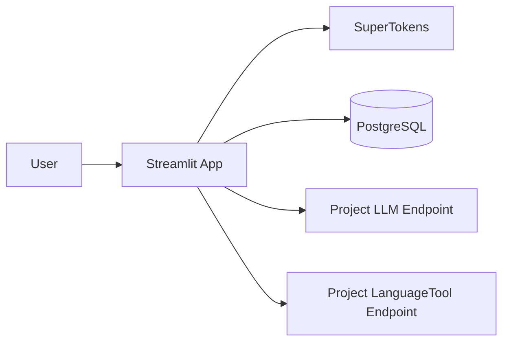

# Architecture Multi-tenant

## Vue d'ensemble

## Modèle de données

- `users`: utilisateurs applicatifs mappés depuis SuperTokens.
- `projects`: espace de travail, correspond à un dataset.
- `project_settings`: paramètres runtime par projet (LLM et correction).
- `entries`: lignes du dataset, filtrées par `project_id`.

Le modèle d'accès est simplifié:
- `1 projet = 1 utilisateur propriétaire` (`projects.created_by`)
- `1 utilisateur = N projets`

## Contrôle d'accès

- Toute action d'écriture passe par `require_role` / `require_admin`.
- Les actions globales comptes passent par `require_super_admin`.
- Les actions sensibles (suppression projet, réglages) sont validées via des wrappers backend `*_as_admin`.
- Le backend reste l'autorité finale.

## Flux utilisateur

1. Login email+mot de passe via SuperTokens (signup public non exposé en UI).
2. Provisioning utilisateur local (`upsert_user_from_su`) avec blocage `disabled_at`.
3. Promotion super admin au premier login si email vérifié et présent dans `SUPER_ADMIN_EMAILS`.
4. Sélection du projet.
5. Chargement des entrées filtrées sur `project_id`.
6. Actions autorisées selon rôle projet + rôle global super admin.

## Gouvernance des comptes

- Invitation-only:
  - création d'un utilisateur invité par super admin
  - envoi d'un lien de définition/réinitialisation du mot de passe.
- Révocation/suppression compte:
  - saga idempotente (`pending`, `provider_done`, `db_done`, `completed`, `failed`)
  - retries bornés (`ACCOUNT_SAGA_MAX_RETRIES`) avec backoff
  - quarantaine DLQ (`quarantined`) + replay admin
  - worker planifié de reprise (`scripts/retry_deprovision_ops.py`).
- Suppression utilisateur:
  - refusée s'il reste des projets owner
  - refusée s'il reste des memberships, sauf procédure explicite de detach memberships.

## Paramétrage LLM/correction par projet

`project_settings` stocke:
- `llm_base_url`
- `llm_model`
- `llm_api_key`
- `llm_timeout_seconds`
- `languagetool_base_url`
- `active_preset_key`
- `custom_presets_json`
- `dimensions_override_json`

L'UI injecte ces paramètres avant appel de génération/correction et charge les dimensions
textuelles (`types`, `structures`, `tons`, `formats`, `publics`, `statuts`) depuis le preset actif.

